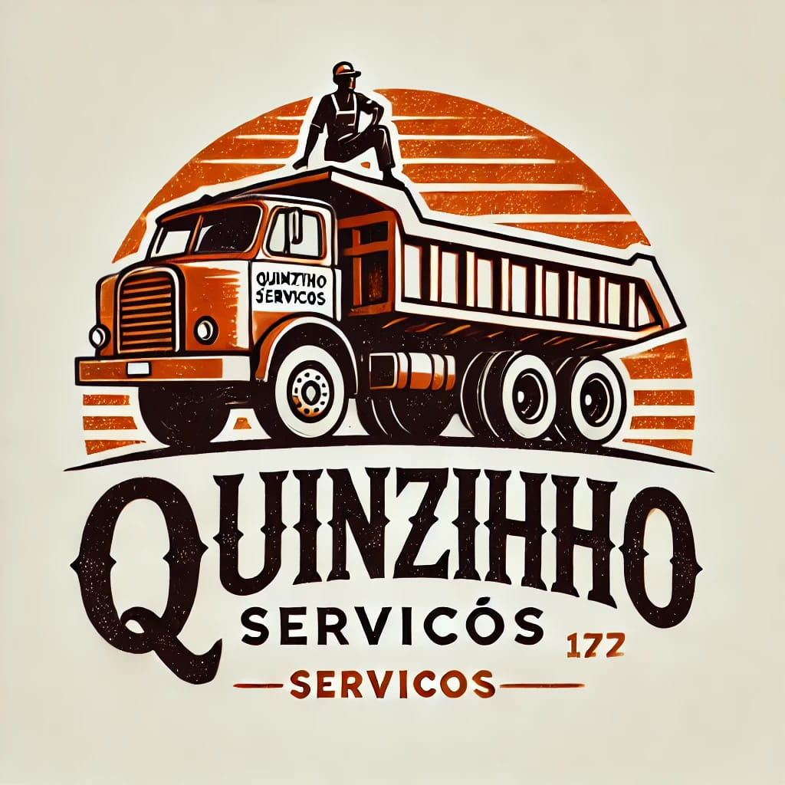

# Quinzinho Serviços - Site Institucional



## 📋 Sobre o Projeto

Site institucional da empresa Quinzinho Serviços, especializada em fornecimento de materiais de construção (areia, brita, cascalho, grama) e serviços de limpeza de terreno e máquinas em Brasília-DF.

## 🎯 Objetivo

Criar uma presença digital profissional para a empresa, facilitando o contato com clientes e apresentando os serviços oferecidos de forma clara e atrativa.

## 🛠️ Tecnologias Utilizadas

- **HTML5** - Estrutura semântica do site
- **CSS3** - Estilização customizada e animações
- **JavaScript** - Interatividade e funcionalidades dinâmicas
- **Tailwind CSS** - Framework CSS para estilização rápida e responsiva
- **CDN Tailwind** - Implementação via CDN para facilitar desenvolvimento

## 🎨 Design e UX

### Paleta de Cores
- **Laranja (#e67e22)** - Cor principal da marca
- **Marrom (#3e2f1b)** - Cor secundária para contraste
- **Stone-100** - Cor de fundo neutra

### Funcionalidades Implementadas

1. **Header com Carrossel de Imagens**
   - Transição automática entre imagens dos serviços
   - Logo circular centralizada
   - Call-to-action para orçamento via WhatsApp

2. **Navegação Dinâmica**
   - Menu que se torna fixo ao rolar a página
   - Transições suaves com CSS
   - Links de navegação interna

3. **Seções Principais**
   - Serviços oferecidos
   - Produtos disponíveis
   - Informações de contato

4. **Botão Flutuante de Orçamento**
   - Sempre visível durante a navegação
   - Link direto para WhatsApp Business

5. **Design Responsivo**
   - Adaptação automática para diferentes tamanhos de tela
   - Grid responsivo para produtos e serviços


## ⚙️ Funcionalidades JavaScript

### 1. Navegação Sticky
```javascript
// Torna a navegação fixa ao rolar a página
window.addEventListener("scroll", () => {
  if (window.scrollY > 100) {
    nav.classList.add("fixed", "top-0", "left-0", "w-full", "shadow-md");
  }
});
```

### 2. Carrossel Automático
- Transição automática entre imagens a cada 4 segundos
- Efeito fade-in/fade-out suave
- Loop infinito das imagens

## 🎯 SEO e Acessibilidade

### Meta Tags Implementadas
- Description detalhada dos serviços
- Keywords relevantes para o negócio
- Author e viewport configurados
- Favicon implementado para múltiplos dispositivos

### Acessibilidade
- Textos alternativos em imagens
- Estrutura semântica HTML5
- Contraste adequado de cores
- Design responsivo

## 📱 Responsividade

O site foi desenvolvido com abordagem mobile-first, garantindo:
- Layout adaptável para smartphones, tablets e desktops
- Grid responsivo usando Tailwind CSS
- Imagens otimizadas para diferentes resoluções
- Navegação touch-friendly em dispositivos móveis


## 👨‍💻 Desenvolvedor

Este projeto foi desenvolvido por **Re1stx Tech**.


## 📄 Licença

Projeto proprietário da empresa Quinzinho Serviços. Todos os direitos reservados.


